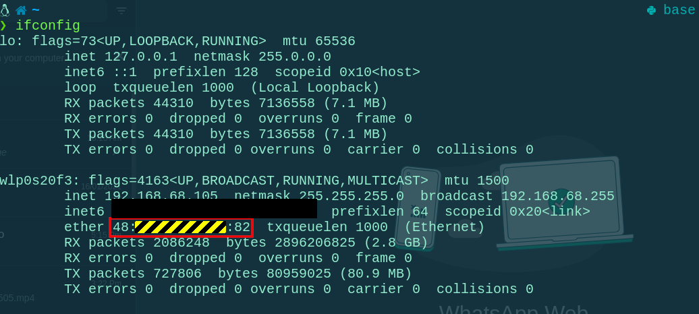
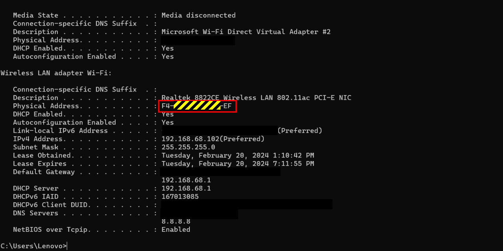

# This is a Network monitor script. 
## It will scan for local network and check devices mac address First and Last connected time. So, we can monitor how long a device was connected to that network.


> 1. 1st run the script. `./netmon1` (It will ask for root permission)
> 2. Stop the script. Open generated CSV file.
> 3. Put desired mac address. Find mac address using following commands.

Unix/Mac
```sh
ifconfig
```

Windows
```cmd
ipconfig /all
```

> 4. Run the script again.
